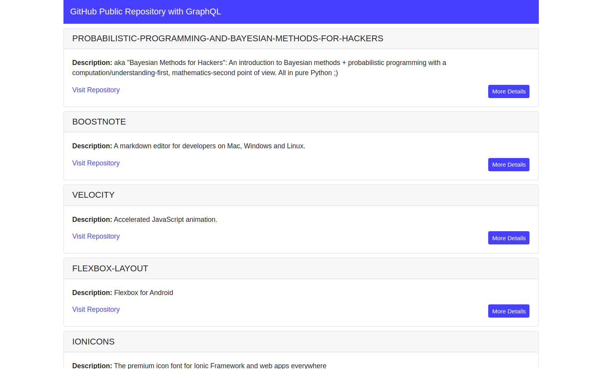

# GitHub-GraphQL
Introductory Web App that shows List View of Public Repositories using the rest-apis of github.
To the web application is powered by Angular 10, it uses Apollo GraphQL and GitHub GraphQL API v4.

<p align="center">
  
</p>

# Setting up
To setup the working environment just clone the project and run the following commands
```
npm install or sudo npm install
```
To start the server
```
ng serve
```
This will start the server at port 4200

# Prerequisite
You will need a Authentication token for making request and getting data from GitHub's. 
[Get it from here](https://help.github.com/en/github/authenticating-to-github/creating-a-personal-access-token)


# References
* [To learn more about GraphQL](https://graphql.org/learn/)
* [To learn more about GitHub Graph](https://developer.github.com/v4/guides/) 

# License

[](https://github.com/DAVFoundation/captain-n3m0/blob/master/LICENSE)
